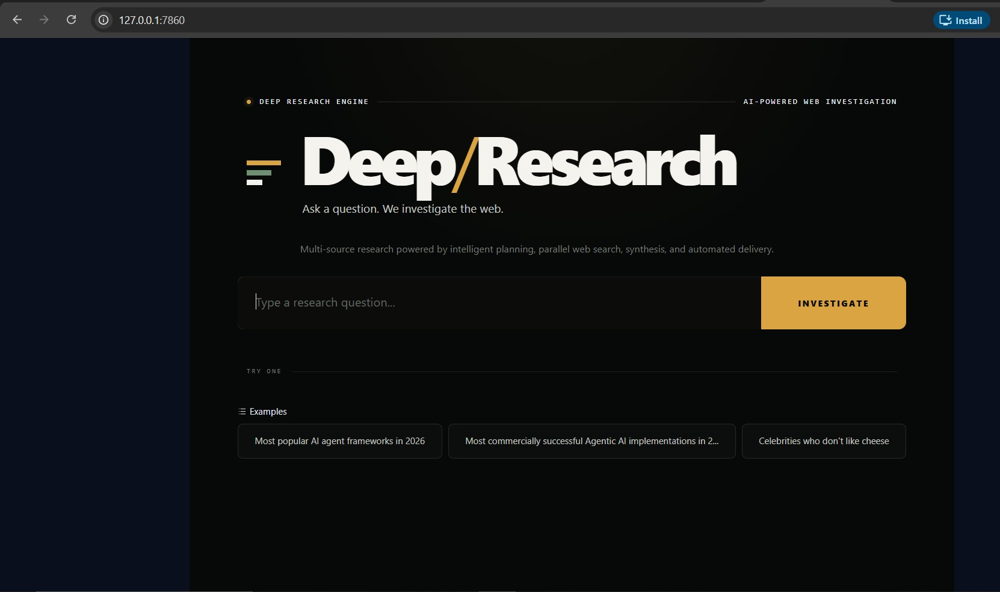

# 🔎 Deep Research Engine

### Agentic AI for Automated Multi-Source Web Research

> **Ask a question. Investigate the web. Synthesize the findings. Get the report.**


---

## 📌 Overview

**Deep Research Engine** is an Agentic AI application that automates the process of researching a topic across multiple web sources and converting the findings into a structured research report.

Instead of asking a single LLM to answer a question directly, the system follows a multi-stage workflow:

**Research Planning → Web Search → Information Gathering → AI Synthesis → Report Generation → Email Delivery**

The project combines **Gemini 3.6 Flash**, **Tavily**, **OpenAI Agents SDK**, **Pydantic**, **Gradio**, and **Gmail SMTP** into one end-to-end research workflow.

---

## 🖥️ Interface Preview



The interface is intentionally simple:

**Enter a research question → Click Investigate → Follow the research process → Receive the final report**

---

## 🎯 Problem Statement

Researching a topic manually can involve several repetitive steps:

- Breaking a broad question into smaller research tasks
- Searching multiple websites and sources
- Collecting and reviewing the information
- Combining findings into a coherent answer
- Structuring and formatting the final report
- Sharing the completed research with others

This project automates these steps through an orchestrated Agentic AI workflow.

---

## ⚙️ How It Works

```text
User
  │
  ▼
Gradio Interface
  │
  ▼
Research Manager
  │
  ▼
Planner Agent
  │
  │  Creates focused research queries
  ▼
Parallel Tavily Searches
  │
  │  Collect information from multiple sources
  ▼
Collected Research Findings
  │
  ▼
Writer Agent
  │
  │  Gemini 3.6 Flash
  ▼
Structured Research Report
  │
  ├───────────────► Gradio UI
  │
  └───────────────► Gmail SMTP
                         │
                         ▼
                   Email Report
```

## 🧰 Technology Stack

| Technology            | Purpose                                |
| --------------------- | -------------------------------------- |
| **Python**            | Core application development           |
| **Gemini 3.6 Flash**  | Research planning and report synthesis |
| **OpenAI Agents SDK** | Agent orchestration                    |
| **Tavily**            | Web search and information retrieval   |
| **Pydantic**          | Data validation and structured outputs |
| **Gradio**            | Interactive web interface              |
| **Gmail SMTP**        | Automated email delivery               |
| **python-dotenv**     | Environment variable management        |
| **Markdown**          | Research report formatting             |

---

## 🚀 Getting Started

1. Clone the repository
 
       git clone https://github.com/hardiksingh171819/agentic-deep-research.git
       cd agentic-deep-research
2. Create a virtual environment

      Windows: 

         python -m venv .venv
        .venv\Scripts\activate
3. macOS / Linux

       python -m venv .venv
       source .venv/bin/activate
4. Install dependencies

       pip install -r requirements.txt
5. Configure environment variables

       Create a .env file using .env.example.
       GEMINI_API_KEY=your_gemini_api_key
       DEFAULT_MODEL_NAME=gemini-3.6-flash

       TAVILY_API_KEY=your_tavily_api_key
       HOW_MANY_SEARCHES=5

       SMTP_EMAIL=your_email@gmail.com
       SMTP_PASSWORD=your_gmail_app_password
       SMTP_TO_EMAIL=recipient@example.com
       SMTP_SERVER=smtp.gmail.com
       SMTP_PORT=587
     **Important**: Never upload your real API keys, passwords, or .env file to GitHub.
7. Run the application

       python app.py
   The Gradio application will start locally.

       http://127.0.0.1:7860
   Open the URL in your browser.

---

## Gmail Email Delivery

The application can automatically send the generated research report through Gmail SMTP.

The SMTP configuration is controlled through the .env file:

    SMTP_SERVER=smtp.gmail.com
    SMTP_PORT=587
    SMTP_EMAIL=your_email@gmail.com
    SMTP_PASSWORD=your_gmail_app_password
    SMTP_TO_EMAIL=recipient@example.com
  For Gmail, use a Google App Password rather than your normal account password.
---

## 🧩 Core Functions

ResearchManager.run(query)

Main entry point for the end-to-end workflow.

    Plan
     ↓
    Search
     ↓
    Write
     ↓
    Email
     ↓
    Display
  
  
**plan_searches(query)**

    Creates a structured research plan from the user's question.

**perform_searches(search_plan)**

    Executes the planned Tavily searches concurrently.

**search_with_tavily(item)**

    Performs an individual web search and formats the returned sources.

**write_report(query, search_results)**

    Runs the Writer Agent and produces the structured research result.

**send_email(query, report)**

    Formats the generated report and sends it through Gmail SMTP.

---

## 🔐 Security

Sensitive credentials are intentionally excluded from version control.

    .env.example   ✅ Safe template
    .env           ❌ Never commit
    API Keys       ❌ Never hard-code
    Passwords      ❌ Never commit

The repository also ignores:

1. Virtual environments
2. Python cache files
3. IDE files
4. Logs
5. Local configuration
6. Temporary files
---

## 🧪 Testing

The project contains basic static pipeline tests.

Run:

    pytest
The test suite checks the presence and integrity of the major project components and configuration files.

---

## 📈 Future Improvements

Potential improvements include:

1. Source quality and credibility scoring
2. Better source deduplication
3. Research-depth controls
4. PDF report generation
5. Research history and persistence
6. Additional email providers
7. Retry and timeout handling
8. Human-in-the-loop review
9. Cloud deployment
10. Improved citation and evidence tracking
---

## 👤 Author
Hardik Singh

GitHub: @hardiksingh171819

---

## 📄 License

This project is licensed under the MIT License.

See LICENSE for more information.

---


